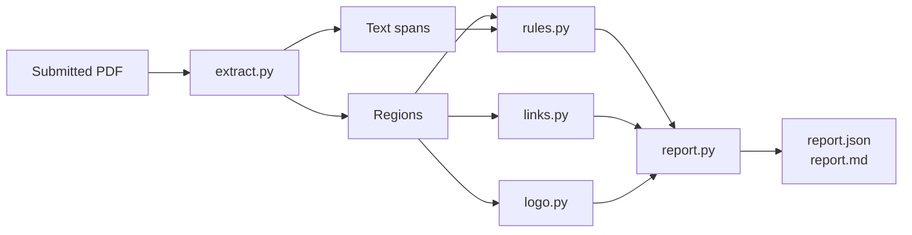

# Implementation Plan: CHN PDF Compliance Validator

**Branch**: `001-chn-compliance-validator` | **Date**: 2026-10-06 | **Spec**: [spec.md](spec.md)

## Summary

A deterministic pre-screener for submitted PDFs. One extraction pass yields flagged
regions and ordered text; eight rules evaluate them; one report object renders as
JSON, Markdown and a web view. No language model and no network at validation time.

## Technical Context

**Language/Version**: Python 3.11+
**Primary Dependencies**: PyMuPDF, pyzbar, imagehash, Pillow — all input-side; rule logic is standard library
**Storage**: Filesystem — `report.json` and `report.md` per document
**Testing**: pytest (71 tests), ruff
**Target Platform**: Local CLI, Streamlit UI, Docker image
**Project Type**: Single project — library with CLI and web front doors
**Constraints**: Deterministic output, no network, no API key, rules testable without PDF I/O
**Scale/Scope**: ~970 lines of source, 8 rules, 6 reference samples

## Constitution Check

| Principle | How this design satisfies it |
|---|---|
| I. Deterministic by default | No model, no network, no env vars; determinism proven by regenerating sample output and diffing |
| II. Rules are pure functions of plain data | `Rule.check()` takes `DocumentContext` of text spans and regions; only `LogoLicenseRule` needs the document handle |
| III. Confidence is explicit | `Finding.confidence` is `confirmed` or `needs_review`, no default |
| IV. Unreadable ≠ non-compliant | `UnreadablePDF` yields no report; unevaluable regions force `NEEDS_REVIEW` |
| V. Verify against the artifact | Sample expectations derived by reading each PDF, never recorded from output |

No violations. No complexity deviations to justify.

---

## 1. Overview

One pass over the PDF produces two artifacts — the regions a submitter marked, and
the document's text in reading order. Everything downstream reads only those.



**Key property.** Rules never touch a PDF. They receive plain records, which is what
makes R11.6 achievable and keeps the suite under a second. `LogoLicenseRule` is the
single exception: image comparison needs the document, so the open handle is carried
on the context for that rule alone.

---

## 2. Components

| Module | Satisfies | Responsibility |
|---|---|---|
| `models.py` | R1.4, R9.4 | `Region`, `TextSpan`, `Finding`, `ComplianceReport`. Data only |
| `extract.py` | R1, R2 | Annotations, vector paths, overlap merging, ordered text |
| `rules.py` | R3–R7 | Required wording and the five rule classes |
| `links.py` | R8 | QR decoding, plain URLs, link annotations |
| `logo.py` | R7.1, R7.2 | Perceptual-hash matching |
| `report.py` | R9 | Status aggregation, JSON and Markdown output |
| `pipeline.py` | R10.1, R10.2 | Wiring, and the one definition of an unreadable input |
| `cli.py` | R10.3 | Arguments and exit codes |
| `web/app.py` | R9.8 | A third view over the same report object |

Dependencies are four packages, all on the input side: **PyMuPDF** reads the PDF,
**pyzbar** decodes QR codes, **Pillow** moves pixels between them, **imagehash**
computes perceptual hashes. No package evaluates compliance — every rule is standard
library `re` plus plain Python, which is how R11.1 and R11.2 hold by construction.

---

## 3. Data model

```python
Region(id, page, bbox, text, source, subtype, color, merged_from)
TextSpan(page, bbox, text, order_key)
Finding(rule_id, confidence, page, bbox, snippet, explanation, region_id)
ComplianceReport(document, status, rules_checked, rules_violated,
                 needs_review_count, findings, regions, regions_unevaluated)
```

Three fields carry weight:

- **`Region.text` is verbatim** (R1.5). A reviewer comparing report to source must see
  the same characters.
- **`TextSpan.order_key` is `(page, y, x)`** (R2.1) and defines reading order. Every
  sequencing rule depends on it, which makes it the single point of failure for R3.
- **`Region.merged_from`** (R1.7) records absorbed regions, so a merge is auditable
  rather than silent.

---

## 4. Rule engine

```python
class Rule(Protocol):
    id: str
    def check(self, doc: DocumentContext) -> list[Finding]: ...
```

Rules are registered in one list, `ALL_RULES`. Adding a rule means writing a class
and a test; `pipeline.py` iterates the list, `report.py` aggregates whatever returns,
and both front ends render it. The rule id flows automatically into `rules_checked`.

The registry is chosen over a single `validate_document()` function because the
rulebook is the part most likely to grow, and it grows by addition rather than by
editing a function everything else depends on.

### Naming-sequence state (R3)

A single ordered walk carries two counters: whether the `CHN` first-mention form has
been seen, and how many standards-family occurrences have passed. Longest form is
matched first, so a bare `CHN` inside a standards phrase is consumed by the longer
match and family precedence (R3.5) falls out of the matching order rather than
needing a special case.

### The citation exemption (R3.7, R11.1)

```python
def is_citation_block(text: str) -> bool:
    return bool(_CITATION_MARKER.search(normalize(text)))
```

This is the one judgment the brief permits a model for. A CHN citation opens with a
fixed phrase, so a regex answers it exactly.

**Trade-off, stated plainly.** The check keys on one lead-in phrase, so a citation
worded differently is missed where a model might generalise. It is one function at
one call site — the place a model would re-enter behind the same signature.

---

## 5. Confidence model

Every finding is `confirmed` or `needs_review`; there is no implicit third state.

- **`confirmed`** — an exact-match, ordinal, or regex check the system can defend.
- **`needs_review`** — something only a person can settle: where a link points (R8.4),
  or a logo with no licence reference (R7.4).

`LOGO-LICENSE` is the one rule whose confirmed findings are good news, so it is
excluded from the violation count (R7.5) and rendered under its own heading. That
produces three report sections (R9.8):

| Section | Meaning |
|---|---|
| Violations | Confident this breaks a rule |
| Needs human review | Surfaced for a person; not a violation |
| Checked and compliant | Verified as meeting the rule |

A reviewer skimming for problems should never meet good news under a heading that
reads like a violation.

---

## 6. Error handling

`pipeline.open_pdf()` is the single definition of "cannot be validated", raising
`UnreadablePDF` with a message meant for a person. Both front doors catch it: the CLI
prints to stderr and exits 1, the UI shows an error box (R10.1, R10.2, R10.4).

An encrypted PDF opens without complaint and only fails when a page is read, so
`needs_pass` is checked explicitly rather than relying on open succeeding.

| Input | Behaviour |
|---|---|
| Corrupt, missing, or not a PDF | Message, exit 1, no report |
| Password-protected | Message, exit 1, no report |
| Truncated | MuPDF recovers what it can, warns on stderr, report produced |
| Image-only region | Counted unevaluable, forces `NEEDS_REVIEW` (R9.6) |
| Undecodable QR bytes | `errors="replace"`, no crash |
| Region clipped off-page | Empty-clip guard before rendering |

The separation in R10.5 is the principle: a document that fails its rules still
produces a report; one that cannot be read produces none.

---

## 7. Output formats

`report.json` is the source of truth; `report.md` is rendered from it; the Streamlit
page is a third view over the same object. Nothing re-derives anything, so the format
a human reads and the format a machine checks cannot drift apart (R9.9).

JSON because it is what tests assert against and what another system would consume.
Markdown because a reviewer wants prose and a table, and it renders anywhere with no
templating dependency.

---

## 8. Testing strategy

| Layer | Approach | Serves |
|---|---|---|
| Rules | Constructed text spans, no PDF I/O | R11.6 |
| Extraction, links, logo | PDFs built on the fly with PyMuPDF | R1, R2, R7, R8 |
| Report | Constructed findings and regions | R9 |
| End to end | The six real samples, expectations derived by reading each PDF | all |
| Determinism | Regenerate sample output and diff | R11.4 |

Sample expectations are derived from reading the source PDFs, never from recording
whatever the tool emitted. That discipline is what surfaced a genuine missing access
date in Sample 01, and a run reporting 23 regions where a reviewer marked 2.

---

## 9. Known structural limits

| Limit | Consequence |
|---|---|
| Reading order is `(page, y, x)` | A multi-column layout whose blocks interleave could traverse out of order, and every R3 rule depends on order |
| CAT-DEF searches one page | A definition on a later page reads as missing (R4.1) |
| No OCR | A page with no text layer yields no spans; flagged regions there count unevaluable rather than passing |
| Citation detection keys on one phrase | A differently worded citation is not recognised (R5.1) |
| Decorative box vs reviewer box | Not separable by geometry; both are extracted. Safe because rules read text, not provenance |
| Logo tolerance untested against variants | Both samples embed the byte-identical image (R7.2) |
